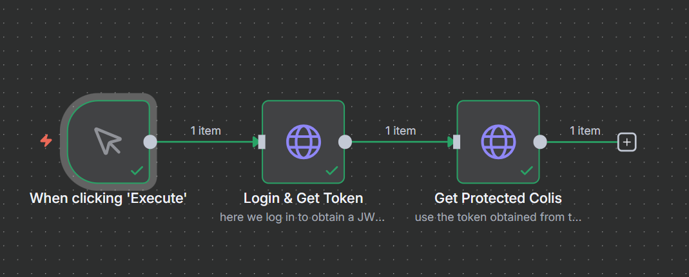

# Système de Gestion de Colis et Transporteurs

## Description
Une application RESTful moderne pour une entreprise de logistique, développée avec **Spring Boot** et **MongoDB**. Ce système permet de gérer différents types de colis (Standard, Fragile, Frigo) et de les assigner intelligemment à des transporteurs en fonction de leurs spécialités.

L'application intègre une sécurité robuste via JWT, une architecture conteneurisée avec Docker, et suit les pratiques DevOps (CI/CD).

## Fonctionnalités Principales
* **Authentification & Sécurité :** Connexion sécurisée (JWT), gestion des rôles (ADMIN, TRANSPORTEUR).
* **Gestion des Transporteurs :** CRUD, filtrage par spécialité, gestion des statuts.
* **Gestion des Colis :** Support du polymorphisme (champs spécifiques pour Frigo/Fragile).
* **Logique Métier :**
    * Assignation intelligente des colis (compatibilité de type).
    * Vérification de la disponibilité des transporteurs.
    * Suivi des statuts de livraison.

## Stack Technique
* **Langage :** Java 17
* **Framework :** Spring Boot 3.x
* **Base de données :** MongoDB (NoSQL)
* **Sécurité :** Spring Security, JWT
* **DevOps :** Docker, Docker Compose, GitHub Actions
* **Tests :** JUnit 5, Mockito
* **Documentation :** Swagger / OpenAPI

## Prérequis
* Docker & Docker Compose
* Java 17 (pour le développement local sans Docker)
* Maven

## Installation et Démarrage

### Option 1 : Via Docker Compose (Recommandé)
Pour lancer l'application et la base de données MongoDB en une seule commande :

```bash
docker-compose up --build

```

### Architecture du Projet

Le projet suit une architecture en couches classique :

controller : Gestion des requêtes HTTP.

service : Logique métier et validations.

repository : Interaction avec MongoDB.

models : Entités de données (Utilisation de @Document et héritage).

security : Configuration JWT et filtres.


### n8n automtisation : 



Jira Url :
https://azeimily2001-1757951624297.atlassian.net/jira/software/projects/SDGCET/boards/139?sprintStarted=true&atlOrigin=eyJpIjoiYjNlODhiMWQ5YmJlNDcxYWFhODI4MDYxNTg3YTc1MmQiLCJwIjoiaiJ9
